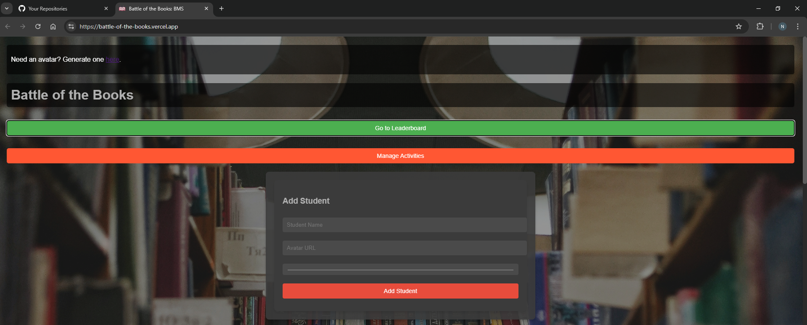
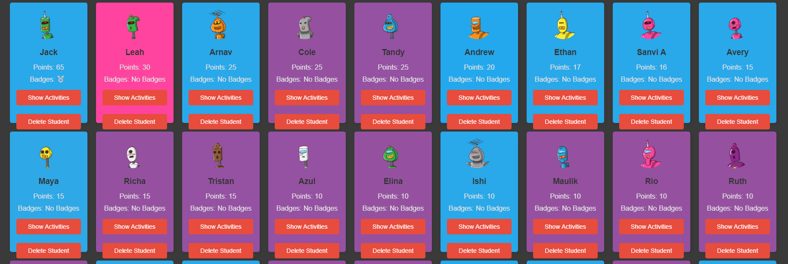
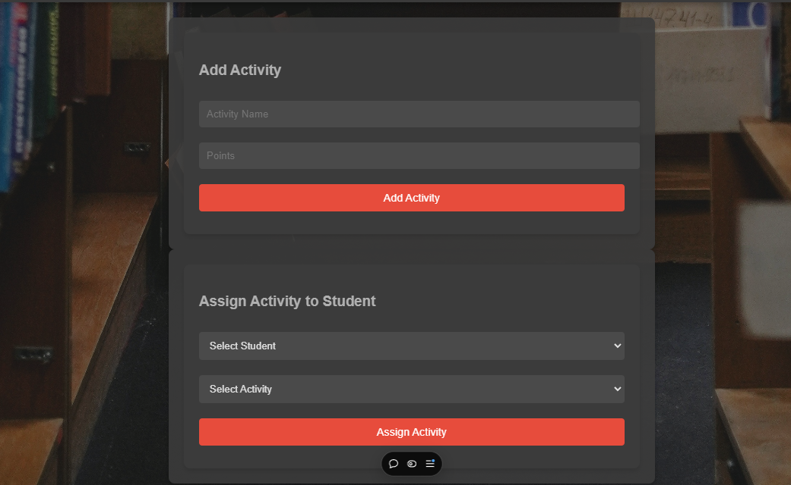
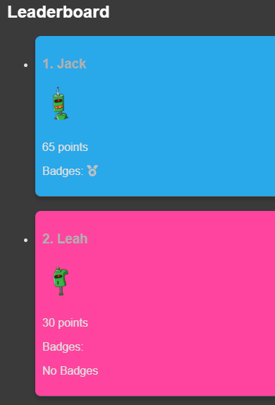

# Battle of the Books Tracker

This project is a web application for tracking student participation and activities in a "Battle of the Books" style competition. The app allows you to add students, assign them activities, track their points, and award them badges based on their progress. The app features dynamic updates, activity management, and a leaderboard to visualize student progress.

## Table of Contents

- [Features](#features)
- [Technologies Used](#technologies-used)
- [Installation](#installation)
- [Usage](#usage)
- [API Endpoints](#api-endpoints)
- [Screenshots](#screenshots)
- [Future Improvements](#future-improvements)
- [License](#license)

## Features

- **Add Students**: Add new students with a name, avatar URL, and color to represent them.
- **Activity Management**: Assign activities to students, track their points, and remove activities as needed.
- **Leaderboard**: Toggle between the leaderboard and input section to view student rankings based on points.
- **Badges**: Award students badges for reaching certain milestones (e.g., 100 points, 50 activities).
- **Dynamic Updates**: No need to refresh; changes are reflected immediately in the UI.
- **Modals**: Show and manage student activities using a modal window.
- **Remove Activities**: Remove activities from a student’s completed activities list.

## Technologies Used

- **Frontend**: React.js (with FontAwesome for icons)
- **Backend**: Node.js, Express.js
- **Database**: MongoDB
- **Styling**: Custom CSS
- **State Management**: React Hooks
- **API Calls**: Axios for HTTP requests

## Installation

### Prerequisites
- Node.js installed on your machine
- MongoDB instance running locally or in the cloud

### Clone the repository

```bash
git clone https://github.com/your-username/battle-of-the-books.git
cd battle-of-the-books
```
Install Dependencies
For the Frontend:
```bash
cd frontend
npm install
```
For the Backend:
```bash
cd ../backend
npm install
```
Configure MongoDB
Make sure you have a MongoDB instance running locally or in the cloud. Update your MongoDB connection string in backend/server.js:

```js
mongoose.connect('mongodb://localhost:27017/battle-of-books', {
  useNewUrlParser: true,
  useUnifiedTopology: true,
});
```

Start the Application
Start the Backend

```bash
cd backend
npm start
```
Start the Frontend
```bash
cd ../frontend
npm start
```

The app will be running at http://localhost:3000 with the backend available at http://localhost:5000.
## Usage

1. **Add Students**: Enter the student’s name, avatar URL, and color, and click "Add Student."
2. **Add Activities**: Add activities with names and points that students can complete.
3. **Assign Activities**: Assign activities to students and track their points.
4. **Leaderboard**: Toggle between the input forms and the leaderboard to see how students are performing.
5. **Badges**: Students will automatically earn badges for milestones like points and activities completed.
6. **Manage Activities**: Use the "Show Activities" button to see and remove activities from a student's record.

## API Endpoints

The backend provides several REST API endpoints:

- `GET /students`: Fetch all students
- `POST /students/add`: Add a new student
- `POST /students/:id/add-points`: Assign points and activities to a student
- `POST /students/:id/remove-activity`: Remove an activity from a student’s record
- `DELETE /students/:id`: Delete a student
- `GET /activities`: Fetch all activities
- `POST /activities/add`: Add a new activity
- `DELETE /activities/:id`: Delete an activity

## Screenshots






## Future Improvements

- **Authentication**: Add login and user authentication so multiple users can manage their own students.
- **Advanced Badge System**: Add more complex badge logic with more types of achievements.
- **Activity Details**: Allow users to provide detailed feedback or notes for each activity assigned to a student.
- **Multi-Class Support**: Allow managing multiple classes or groups of students.

## License

This project is licensed under the MIT License.


